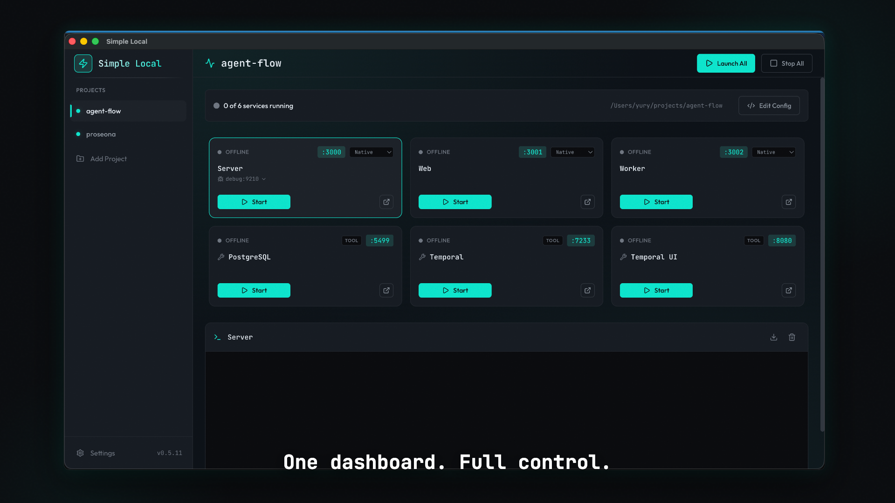

# Simple Local

A desktop app for running multi-service projects locally without the hassle.

Point it at a project folder and it uses AI to discover your services — start commands, ports, dependencies, environment variables — then gives you a single dashboard to manage everything.

[**Watch the demo →**](https://youtu.be/aeqMkra2n4E)

[](https://youtu.be/aeqMkra2n4E)

## Table of contents

- [Features](#features)
- [Native vs Container mode](#native-vs-container-mode)
- [MCP server for AI agents](#mcp-server-for-ai-agents)
- [Manual configuration](#manual-configuration)
- [Install](#install)
- [Build from source](#build-from-source)

## Features

- **AI-powered discovery** — point it at a project folder and it detects services, start commands, ports, dependencies, and environment variables automatically
- **Automatic port remapping** — every service gets a unique port allocated at startup, so nothing collides even when multiple projects use the same defaults
- **Hardcoded port detection** — flags hardcoded ports in your code and suggests fixes so services can work with dynamically assigned ports
- **Dependency & tool discovery** — detects required runtimes, databases, and tools (Node, Python, Postgres, Redis, etc.) so you know what's needed before hitting "start"
- **Container or native** — run each service your way, mix both in the same project
- **Unified logs** — all service output in one place, no more dozen terminal tabs
- **Built-in MCP server** — AI agents (Claude Code, Cursor, etc.) can start/stop services, check statuses, and read logs without leaving the conversation

## Native vs Container mode

Each service can run in one of two modes:

- **Native** — runs directly on your machine using your local runtimes (Node, Python, etc.). Fast startup, no overhead, uses your existing toolchain.
- **Container** — runs inside a devcontainer via Docker. Fully isolated environment with its own dependencies, closer to production. Requires a container runtime (Docker Desktop, Colima, or Podman).

You can mix modes per service — run your frontend natively for speed while running the database in a container for isolation.

When you switch a service to container mode, Simple Local auto-generates a `devcontainer.json` tailored to the service:

- Detects the language and package manager (Node/npm/pnpm/Bun/Python)
- Picks the right base image (`mcr.microsoft.com/devcontainers/javascript-node:20`, etc.)
- Forwards service and debug ports automatically
- Bind-mounts your project source so code changes are live
- Rewrites `localhost` references to `host.docker.internal` so container services can reach host services

Generated configs live in `<project>/.simple-local/devcontainers/<service>/devcontainer.json` — you can customize them if needed.

## MCP server for AI agents

Simple Local runs a built-in MCP server so AI agents (Claude Code, Cursor, Windsurf, etc.) can manage your services without leaving the conversation.

**Available tools:**

| Tool | Description |
|------|-------------|
| `list_projects` | List all projects |
| `get_project` | Get project details |
| `list_services` | List services with status, ports, mode |
| `get_service_status` | Detailed status of a single service |
| `start_service` | Start a service (optionally specify native/container mode) |
| `stop_service` | Stop a service |
| `restart_service` | Stop then start a service |
| `get_logs` | Get recent logs (default 50 lines, max 500) |

### Setup

The MCP server runs on `http://localhost:19275/mcp` (localhost-only, no auth needed).

**Claude Code:**

```bash
claude mcp add --transport http simple-local http://localhost:19275/mcp
```

**Cursor / Windsurf:**

Add to your MCP config (`.cursor/mcp.json` or equivalent):

```json
{
  "mcpServers": {
    "simple-local": {
      "url": "http://localhost:19275/mcp"
    }
  }
}
```

**Claude Desktop:**

Add to `~/Library/Application Support/Claude/claude_desktop_config.json`:

```json
{
  "mcpServers": {
    "simple-local": {
      "command": "npx",
      "args": ["mcp-remote", "http://localhost:19275/mcp"]
    }
  }
}
```

Once connected, your AI agent can do things like:

```
> "Start the API server and check if it's healthy"
> "What services are running in artizen?"
> "Restart the frontend and show me the last 20 log lines"
```

## Manual configuration

AI discovery handles most setups automatically, but you can also configure services manually. Create a `.simple-local/config.json` in your project root:

```json
{
  "name": "my-project",
  "services": [
    {
      "id": "backend",
      "name": "Backend API",
      "path": "./packages/backend",
      "command": "npm run dev",
      "port": 3000,
      "debugPort": 9229,
      "env": {
        "DATABASE_URL": "postgresql://localhost:5432/mydb",
        "REDIS_URL": "redis://localhost:6379"
      },
      "active": true,
      "mode": "native"
    },
    {
      "id": "frontend",
      "name": "Frontend App",
      "path": "./packages/frontend",
      "command": "npm run dev",
      "port": 3001,
      "env": {
        "API_URL": "http://localhost:${services.backend.port}"
      },
      "dependsOn": ["backend"],
      "active": true,
      "mode": "native"
    },
    {
      "id": "postgres",
      "name": "PostgreSQL",
      "type": "tool",
      "path": ".",
      "command": "docker run -p 5432:5432 postgres:16",
      "port": 5432,
      "env": {},
      "active": true,
      "mode": "native"
    }
  ]
}
```

Key fields per service:

| Field | Required | Description |
|-------|----------|-------------|
| `id` | yes | Unique identifier (used in `dependsOn` and env interpolation) |
| `name` | yes | Display name |
| `path` | yes | Working directory relative to project root |
| `command` | yes | Start command |
| `port` | no | Port the service listens on |
| `env` | yes | Environment variables (supports `${services.<id>.port}` interpolation) |
| `active` | yes | Whether to include this service |
| `mode` | yes | `"native"` or `"container"` |
| `type` | no | `"service"` (default) or `"tool"` for infrastructure like databases |
| `dependsOn` | no | Array of service IDs that must start first |
| `debugPort` | no | Port for debugger attachment |
| `debugCommand` | no | Alternative command for debug mode |

## Install

Download the latest release for your platform from [GitHub Releases](https://github.com/ykosyakov/simple-local/releases):

- **macOS** — `.dmg` (universal, works on both Apple Silicon and Intel)
- **Windows** — `-setup.exe`
- **Linux** — `.AppImage` or `.deb`

> **macOS note:** The app is currently unsigned. On first launch, right-click the app and choose "Open" (or go to System Settings → Privacy & Security → click "Open Anyway").

## Build from source

Requires Node.js 20+ and npm.

```sh
git clone https://github.com/ykosyakov/simple-local.git
cd simple-local
npm install
npm run build:mac    # or build:win, build:linux
```

The built app will be in the `dist/` directory.
